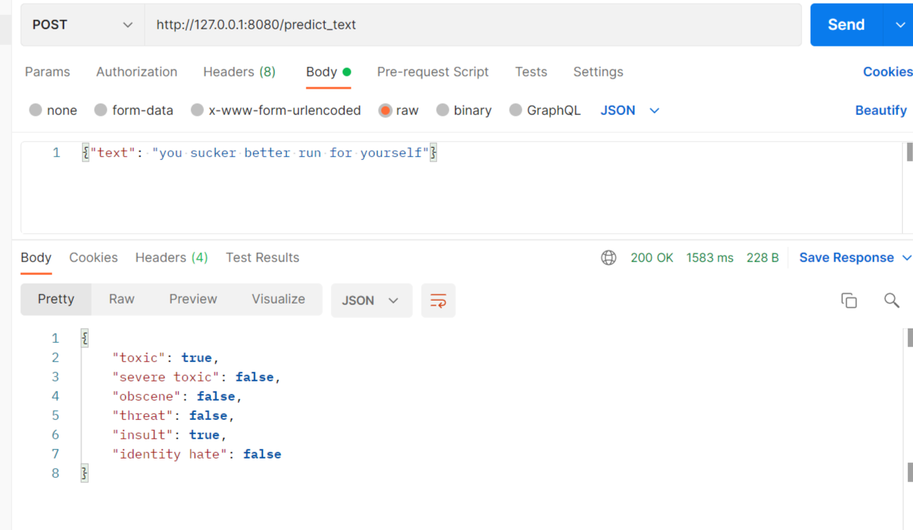

# ML API Template 🚀 for SpeakSure Toxicity Detection

## How to use

To get started, follow these steps:

1. Clone the repository:

```sh
git clone https://github.com/your-username/your-repository.git
```

2. Install the required libraries:

```sh
pip install -r requirements.txt
```

3. Prepare your machine learning model:

- Our toxicity model can be downloaded from this link: https://drive.google.com/drive/u/1/folders/10M7n8k2hZXLT-upBNei2CMUDxSRY_Ksm
- Add the entire folder `end-to-end` to the same folder as `main.py`

4. Run the server:

```sh
python main.py
```

5. On Postman, test the API

POST

```sh
http://127.0.0.1:8080/predict_text
```

On request body, type in the JSON input

```sh
{"text": "you sucker better run for yourself"}
```

You will get the result of the prediction:


